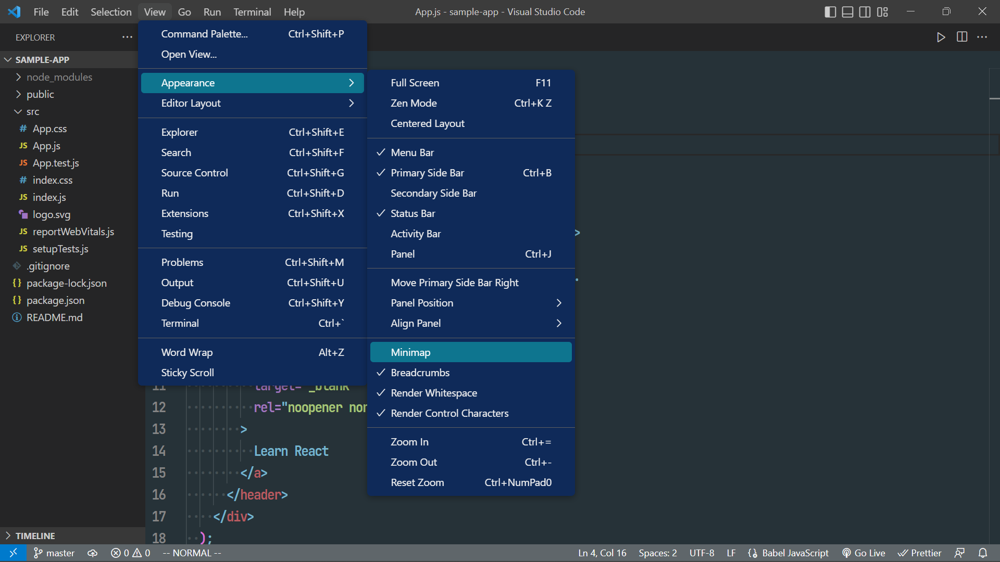
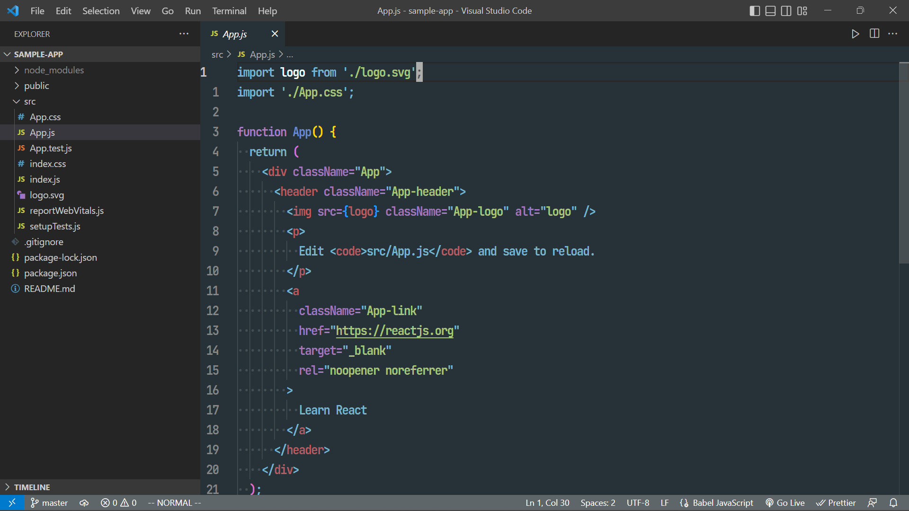
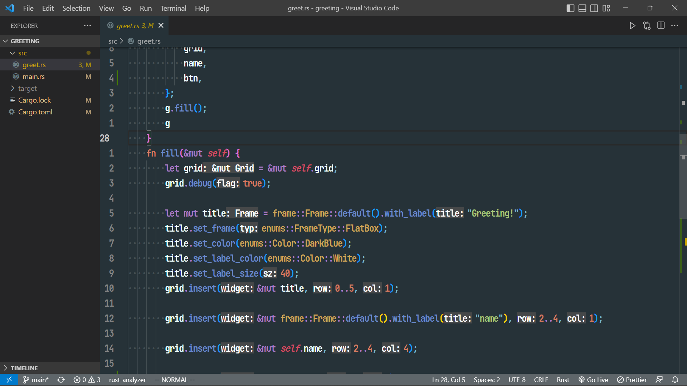

# TerraceCat

Dark base color theme for vscode.

Mainly warm colors that are easy on the eyes.

  
  

# Screenshot

It is stored in the github screenshot directory.

## Menu

## Javascript

## Rust

# Author

Daiki Nakashima