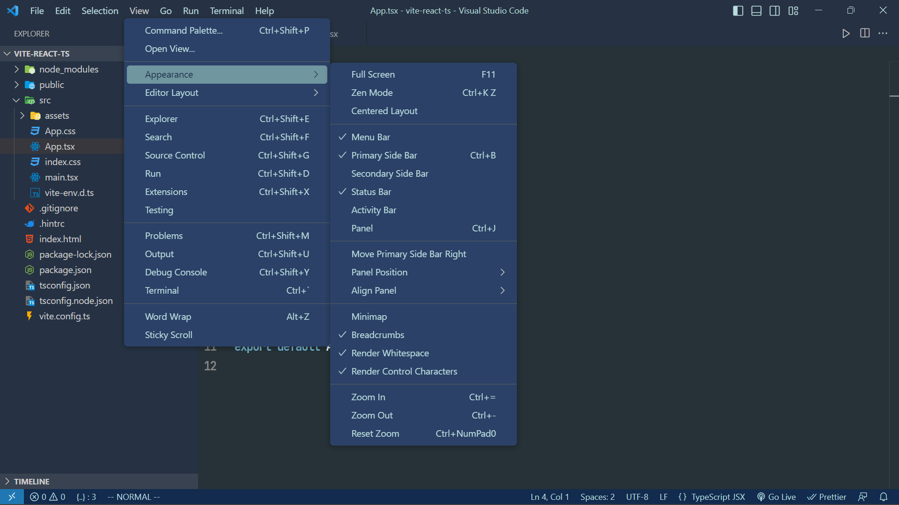

# Contents of version 0.2.0

## Added

- Blue underlining on the active tab.

## Change

- Change the entire color scheme to a blue base, including the sidebar and status bar.
- The light blue color makes it easy to see.

# Screenshot

## Menu

## Javascript

